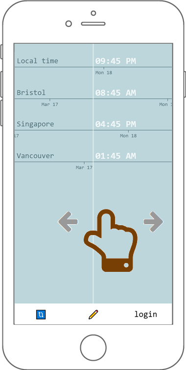
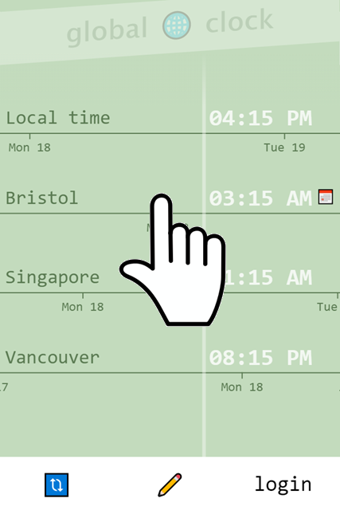
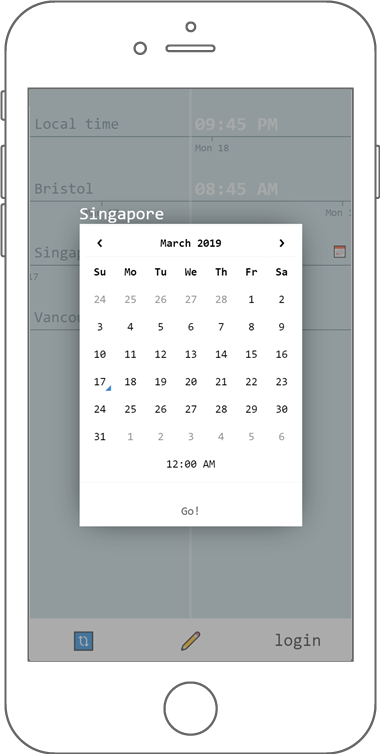
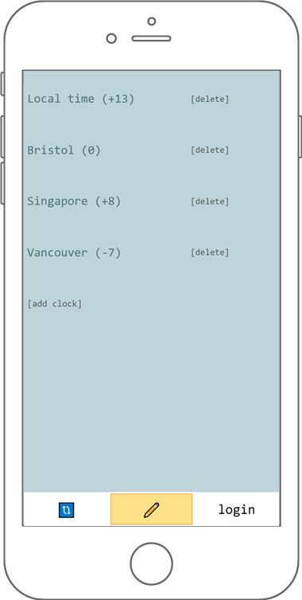
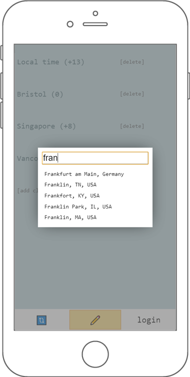
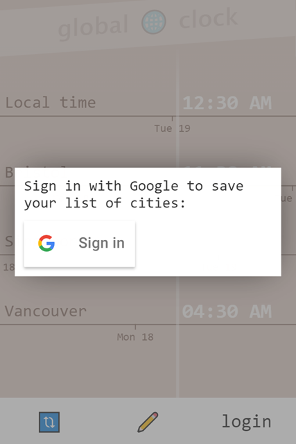

# Global Clock

Web app to help schedule meetings across time zones.

[https://global-clock.now.sh](https://global-clock.now.sh)

## Features

- Scroll through time infinitely:\
  
- Pick time & date in a specific city using calendar:\
  
  
- Manage list of cities / time zones using Google Maps API:\
  
  
- Sign in with Google to save your list:\
  

## Stack

- react
- d3
- express
- mongodb
- google maps api
- google sign-in
